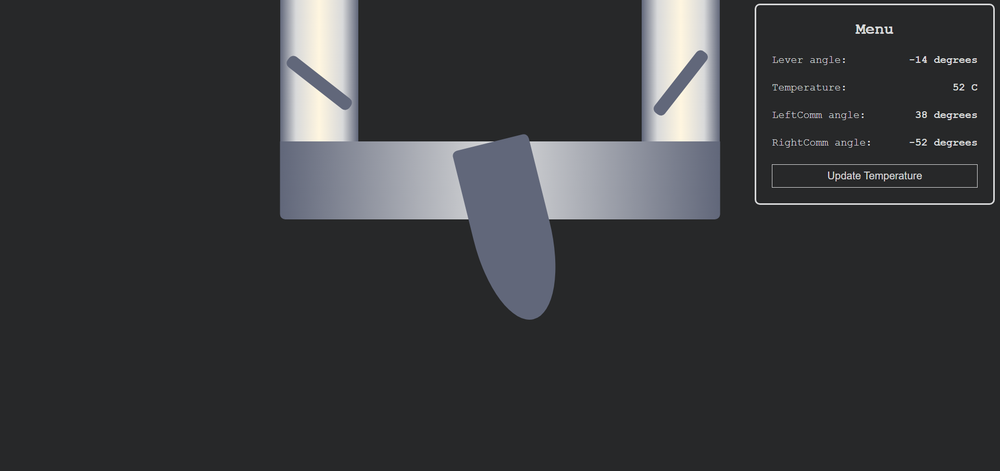

# Hydro Tap

## Description

Hydro Tap is a website featuring a simple visualization of a tap that allows users to regulate the water temperature.

## Functionality

The site consists of two key elements:

1. **Tap Control**: Users can interact with the tap by rotating it using mouse movements.
2. **Menu Display**: The menu displays real-time information about the water temperature and the angles of the tap and communicators.

### New Feature: Automatic Comfort Temperature Setting

Now introducing an exciting new feature - the automatic setting of a comfortable water temperature using fuzzy logic inference. The backend part of the program handles the computation to ensure users experience optimal comfort.

## Screenshots

### Random Position

### Optimal Temperature

## Backend

All computations, including the new automatic temperature feature, are processed on the backend. You can find the backend part of the program by following this [link](https://github.com/Euphoriaerika/AutoTemp-Control).

## Contact

For any questions or suggestions regarding this project, feel free to contact me via [LinkedIn](https://www.linkedin.com/in/bohdan-rudenko-b5726928a/).
