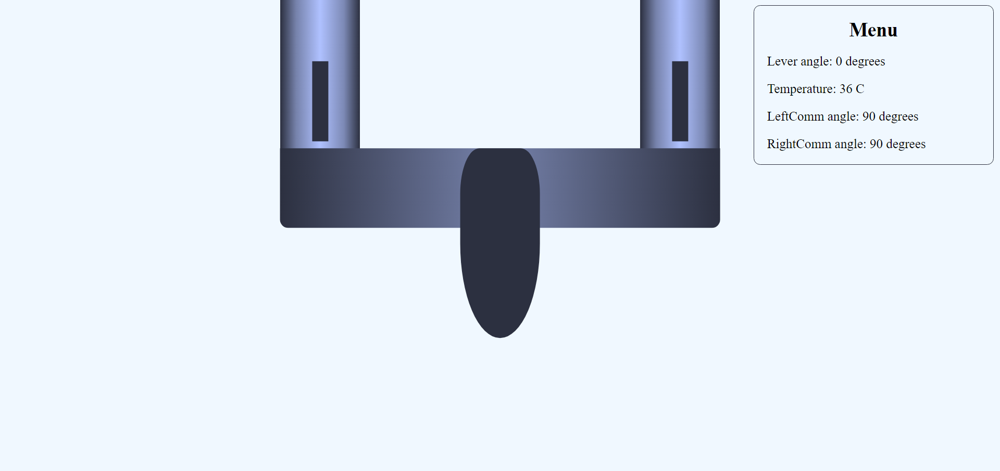
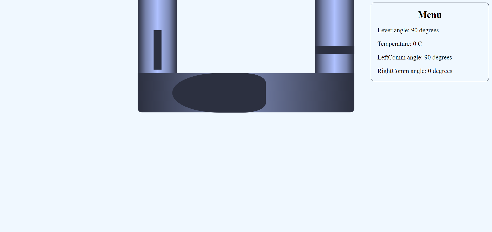
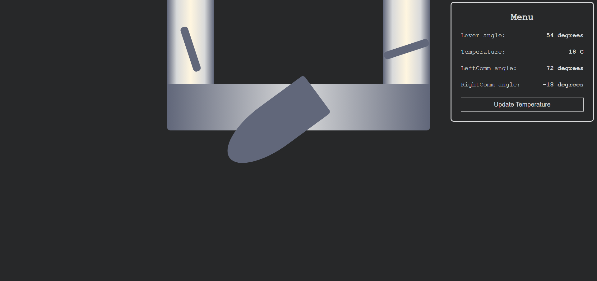

# Hydro Tap

## Description

Hydro Tap is a website featuring a simple visualization of a tap that allows users to regulate the water temperature.

## Functionality

The site consists of two key elements:
1. **Tap Control**: Users can interact with the tap by rotating it using mouse movements.
2. **Menu Display**: The menu displays real-time information about the water temperature and the angles of the tap and communicators.

## Screenshots

### Start State

### Cold State

### Random State

## Contact

For any questions or suggestions regarding this project, feel free to contact me via [LinkedIn](https://www.linkedin.com/in/your-linkedin-profile/).
